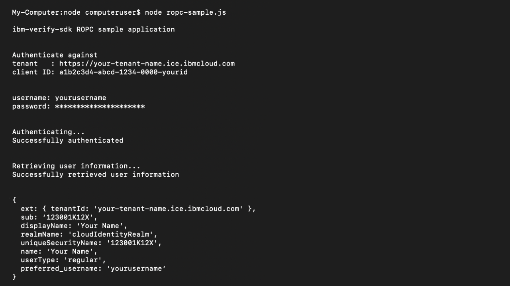

# Dev portal sample app for Resource Owner Password Credentials (ROPC) grant type.

This sample shows how to use the openid-client library with Node.js to:
- Authenticate a registered user via IBM Security Verify
- Successfully make an API request to `userinfo` endpoint to return the authenticated users details.

## Running the sample app:
1. Create a `.env` file using the snippet generated by the Developer portal. You can refer to the `.env.example` file for the envrironment variables required to run this sample app.
2. From the CLI enter `npm install`
3. After successfully intalling node_modules, from the CLI start the sample application by running `npm run start`
4. When prompted enter a valid username and password that exists in your IBM Security Verify tenant.
5. If authentication is successful, you will see information about the authenticated user. This information is being retrieved by calling the OIDC UserInfo endpoint.

## Troubleshooting
- CLI displaying `npm ERR! code E401` when trying to run `npm install`. Delete the package-lock.json file and run `npm install` again.

## License

The MIT License (MIT)

Copyright (c) 2023 - IBM Corp. 

Permission is hereby granted, free of charge, to any person obtaining a copy of this software and associated documentation files (the "Software"), to deal in the Software without restriction, including without limitation the rights to use, copy, modify, merge, publish, distribute, sublicense, and/or sell copies of the Software, and to permit persons to whom the Software is furnished to do so, subject to the following conditions:

The above copyright notice and this permission notice shall be included in all copies or substantial portions of the Software.

THE SOFTWARE IS PROVIDED "AS IS", WITHOUT WARRANTY OF ANY KIND, EXPRESS OR IMPLIED, INCLUDING BUT NOT LIMITED TO THE WARRANTIES OF MERCHANTABILITY, FITNESS FOR A PARTICULAR PURPOSE AND NONINFRINGEMENT. IN NO EVENT SHALL THE AUTHORS OR COPYRIGHT HOLDERS BE LIABLE FOR ANY CLAIM, DAMAGES OR OTHER LIABILITY, WHETHER IN AN ACTION OF CONTRACT, TORT OR OTHERWISE, ARISING FROM, OUT OF OR IN CONNECTION WITH THE SOFTWARE OR THE USE OR OTHER DEALINGS IN THE SOFTWARE.
